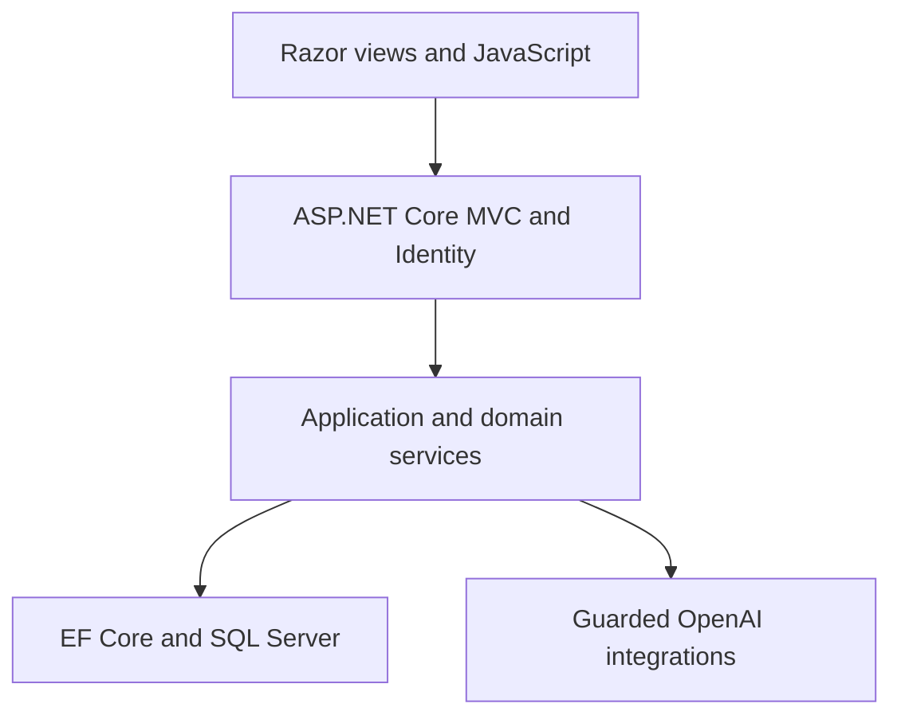

# InTakeWise

[](https://github.com/DeanProgramming/InTakeWise/actions/workflows/main_intakewise.yml)
[](https://dotnet.microsoft.com/)
[](https://intakewise.azurewebsites.net/)

**InTakeWise** is a full-stack nutrition and fitness application built with **ASP.NET Core MVC**. It turns everyday inputs—what a user ate, how they trained, what is in their pantry, and a photograph of a grocery receipt—into structured tracking data and personalised meal-planning suggestions.

The project combines traditional web application engineering with guarded OpenAI integrations, including strict response schemas, domain validation, request limits, timeouts, and safe failure handling.

## Live Demo

**[Open InTakeWise](https://intakewise.azurewebsites.net/)**

Select **Try the demo** on the login page to explore a fictional profile, meal and workout logs, pantry contents, and a generated shopping and meal plan.

The public demo is deliberately **read-only**:

- no account or password is required
- all displayed health and nutrition data is fictional
- write requests and account-management routes are blocked
- live OpenAI generation is disabled
- pre-generated sample results remain available if OpenAI is unavailable

## Overview

InTakeWise brings several related fitness tasks into one application. Users can create a personal profile, calculate gym-day and non-gym-day nutrition targets, log meals and workouts in natural language, maintain a pantry, import groceries from a receipt image, and generate a meal plan that accounts for the food they already own.

The application uses **SQL Server** through **Entity Framework Core**, **ASP.NET Identity** for authentication, and the official **OpenAI .NET SDK** for AI-assisted analysis. It is deployed to **Azure App Service** through a GitHub Actions build, test, and deployment pipeline.

## Features

### Authentication and profile setup

- Account registration and sign-in with ASP.NET Identity
- Confirmed-account requirement and failed-login lockout protection
- Three-step onboarding flow for personal details, activity level, gym days, and fitness goal
- Separate calorie and macro targets for gym and non-gym days
- Estimated weight and body-fat projections

### AI-assisted meal and workout logging

- Natural-language meal entry with estimated calories, protein, carbohydrates, fat, and fibre
- Natural-language workout entry with estimated activity, duration, intensity, and calories burned
- Strict JSON-schema responses followed by server-side domain validation
- Per-user burst limits, daily quotas, cancellation support, and explicit timeouts
- User-friendly error handling without exposing provider responses or sensitive input in logs

### Daily summary

- Meal status for breakfast, dinner, and tea
- Daily calories and macro totals
- Workout calories and net-calorie summary
- Progress against the user's gym-day or non-gym-day targets
- Europe/London-aware daily boundaries

### Pantry management

- Add, edit, and remove pantry items
- Case-insensitive food-name normalisation
- Duplicate merging by food name
- Compatible unit conversion across `mg`, `g`, `kg`, `ml`, and `l`
- Support for item, tin, can, pack, and bottle counts
- Clear validation when incompatible units cannot be combined

### Receipt photo import

- Upload a JPG, PNG, or WebP grocery receipt of up to 10 MB
- Extract food and drink lines using OpenAI vision
- Reject unrelated or unreadable images safely
- Review, edit, add, or remove extracted rows before saving
- Merge confirmed items into existing pantry quantities transactionally
- Load a built-in fictional receipt when a real image is not available

Receipt images are processed for the current request and are not saved by InTakeWise. Only the reviewed pantry rows are persisted when the user confirms them.

### Shopping and meal planning

- Generate a shopping list and meal plan for the remaining days of the current week
- Use the user's profile, gym schedule, calorie targets, macro targets, and pantry contents
- Prefer existing pantry items and suggest only missing ingredients
- Save one current plan per user
- View daily meal overviews, ingredients, cooking steps, and nutrition totals
- Persist plan replacements inside a retryable EF Core transaction

## Core Workflows

### 1. Set up a profile

The guided profile wizard records age, gender selection, height, weight, normal activity level, gym days, and fitness goal. A dedicated nutrition service then calculates gym-day and non-gym-day targets.

### 2. Log a meal or workout

The user writes a plain-language description. InTakeWise validates the input, requests a structured AI analysis, validates the returned values, and saves the result against the authenticated user and the current London-local day.

### 3. Build the pantry

Pantry items can be entered manually or extracted from a receipt photograph. Food names are normalised and compatible quantities are merged to prevent duplicate stock records.

### 4. Generate the current-week plan

InTakeWise combines the user's targets and scheduled gym days with their pantry contents. The resulting shopping list and daily meals are validated and saved as a single user-scoped plan.

## System Architecture



The application is organised into the following areas:

1. **Presentation layer**
   - MVC controllers and Razor views
   - View components and responsive CSS
   - Focused JavaScript modules for form rows, loading states, and demo feedback

2. **Application and domain layer**
   - Nutrition target calculations
   - Meal and workout logging
   - Pantry normalisation and unit conversion
   - Receipt-image analysis
   - Shopping-plan generation and validation
   - London-local clock abstraction

3. **Data and identity layer**
   - Entity Framework Core with SQL Server
   - ASP.NET Identity tables and user relationships
   - Foreign keys, unique indexes, length limits, and database check constraints
   - Retriable transactions for multi-step persistence

4. **AI integration layer**
   - Lazily created OpenAI clients
   - Operation-specific models and timeouts
   - Strict JSON schemas and independent response parsers
   - Input validation, prompt-injection boundaries, per-user quotas, and sanitised logs

## Technology Stack

| Area | Technology |
| --- | --- |
| Web application | .NET 9, ASP.NET Core MVC, Razor Views |
| Authentication | ASP.NET Core Identity |
| Data access | Entity Framework Core |
| Database | SQL Server; SQLite for isolated automated tests |
| AI integration | OpenAI .NET SDK with structured JSON-schema output |
| Front end | HTML, CSS, JavaScript, Bootstrap |
| Testing | xUnit, `WebApplicationFactory`, EF Core SQLite, Coverlet |
| Delivery | GitHub Actions and Azure App Service |

## Data Model Highlights

| Entity | Responsibility |
| --- | --- |
| `UsersInformation` | Profile, activity settings, goals, and calculated targets |
| `FoodItem` | Normalised shared food identity and optional nutrition data |
| `PantryItem` | User-owned food quantity and unit |
| `MealLogEntry` | Daily meal input and analysed nutrition totals |
| `WorkoutLogEntry` | Workout description and analysed activity totals |
| `ShoppingList` | User's current generated plan |
| `ShoppingListItem` | Ingredients missing from the pantry |
| `ShoppingMealDay` | Daily meal details and nutrition totals |

All user-owned records are scoped by the authenticated Identity user. Foreign keys, uniqueness rules, and check constraints reinforce that separation and reject invalid stored values.

## Security and Reliability

- Anti-forgery validation on state-changing MVC actions
- Confirmed accounts and a five-attempt login lockout policy
- Local-only return URL validation
- Passwordless, claim-identified demo account with read-only middleware
- Demo restrictions on profile and Identity-management routes
- Server-side input length, file size, file signature, enum, and numeric-range validation
- AI inputs treated as untrusted data rather than instructions
- Structured AI output with strict schema and domain-level validation
- Per-user request quotas and operation-specific timeouts
- Sanitised operational logs that use non-reversible user references
- Database foreign keys, unique indexes, and non-negative-value constraints
- Explicit cancellation and safe provider-failure handling

## Automated Tests

The solution currently contains **55 xUnit test methods** across unit, integration, and end-to-end smoke test suites.

Coverage includes:

- nutrition target calculations and boundary inputs
- pantry unit conversions and incompatible units
- food-name normalisation
- AI input and response validation
- AI request limits
- Europe/London dates and daylight-saving transitions
- receipt file signatures and size validation
- demo read-only enforcement
- account and return-URL security
- database integrity and cross-user data isolation
- meal-log replacement behaviour
- login → profile → meal log → shopping plan smoke flow

Run the complete suite with:

```bash
dotnet test --configuration Release --collect:"XPlat Code Coverage"
```

GitHub Actions restores, builds, and tests every pull request targeting `main`. Pushes to `main` are deployed to Azure only after the build and tests succeed.

## Running the Project Locally

### Prerequisites

- [.NET 9 SDK](https://dotnet.microsoft.com/download/dotnet/9.0)
- SQL Server or SQL Server LocalDB
- [`dotnet-ef`](https://learn.microsoft.com/ef/core/cli/dotnet) command-line tool
- An OpenAI API key for live meal, workout, shopping-plan, and receipt analysis

The read-only demo uses seeded results and does not require OpenAI to render.

### 1. Clone and restore

```bash
git clone https://github.com/DeanProgramming/InTakeWise.git
cd InTakeWise
dotnet restore
```

### 2. Configure development secrets

The following example uses SQL Server LocalDB on Windows:

```bash
dotnet user-secrets set "ConnectionStrings:DefaultConnection" "Server=(localdb)\MSSQLLocalDB;Database=InTakeWise;Trusted_Connection=True;MultipleActiveResultSets=true" --project InTakeWise/InTakeWise.csproj
dotnet user-secrets set "OpenAI:ApiKey" "YOUR_OPENAI_API_KEY" --project InTakeWise/InTakeWise.csproj
```

Use an appropriate SQL Server connection string on systems without LocalDB. Do not commit real credentials to `appsettings.json`.

### 3. Apply migrations

```bash
dotnet ef database update --project InTakeWise/InTakeWise.csproj --startup-project InTakeWise/InTakeWise.csproj
```

### 4. Run the application

```bash
dotnet run --project InTakeWise/InTakeWise.csproj
```

Open the HTTPS address printed by ASP.NET Core in the terminal.

## Configuration

| Setting | Purpose | Required |
| --- | --- | --- |
| `ConnectionStrings:DefaultConnection` | SQL Server connection string | Yes |
| `OpenAI:ApiKey` or `OPENAI_API_KEY` | Enables live AI analysis and generation | For live AI only |
| `Demo:Enabled` | Enables the seeded, read-only portfolio demo | No |

Optional OpenAI model selections and AI safety limits can also be changed through application configuration. Sensible defaults are included in `appsettings.json`.

## Project Structure

| Path | Contents |
| --- | --- |
| `InTakeWise/Areas/Identity` | Account registration, login, confirmation, and recovery pages |
| `InTakeWise/Controllers` | MVC request and user-flow coordination |
| `InTakeWise/Data` | EF Core context, migrations, and demo seeders |
| `InTakeWise/Models` | Persisted domain entities |
| `InTakeWise/Services` | Business logic, parsers, calculations, and AI integrations |
| `InTakeWise/Security` | Demo restrictions and AI-access guard |
| `InTakeWise/Validation` | Shared application limits |
| `InTakeWise/Views` | Razor UI |
| `InTakeWise/wwwroot` | CSS, JavaScript, and static assets |
| `InTakeWise.Tests` | Unit, integration, infrastructure, and smoke tests |
| `.github/workflows` | Build, test, artifact, and Azure deployment workflow |

## AI and Data Notes

- Meal, workout, and planning results are estimates and may be inaccurate.
- InTakeWise is not a medical service and does not replace qualified nutritional or medical advice.
- Live AI features send only the information required for the selected operation to OpenAI.
- Receipt images are not persisted by InTakeWise after analysis.
- The current portfolio build does not use analytics or advertising cookies.
- The public demo contains fictional data and does not perform live AI requests.

See the live application's [privacy page](https://intakewise.azurewebsites.net/Home/Privacy) for the current demonstration-build notice.

## Current Limitations and Next Steps

This repository is a portfolio application rather than a production health platform. The main next steps are:

- migrate from .NET 9 to .NET 10 LTS
- add production email delivery and self-service account deletion

## Author

Built by **Dean Holland** as a personal software-development portfolio project.

GitHub: [DeanProgramming](https://github.com/DeanProgramming)
